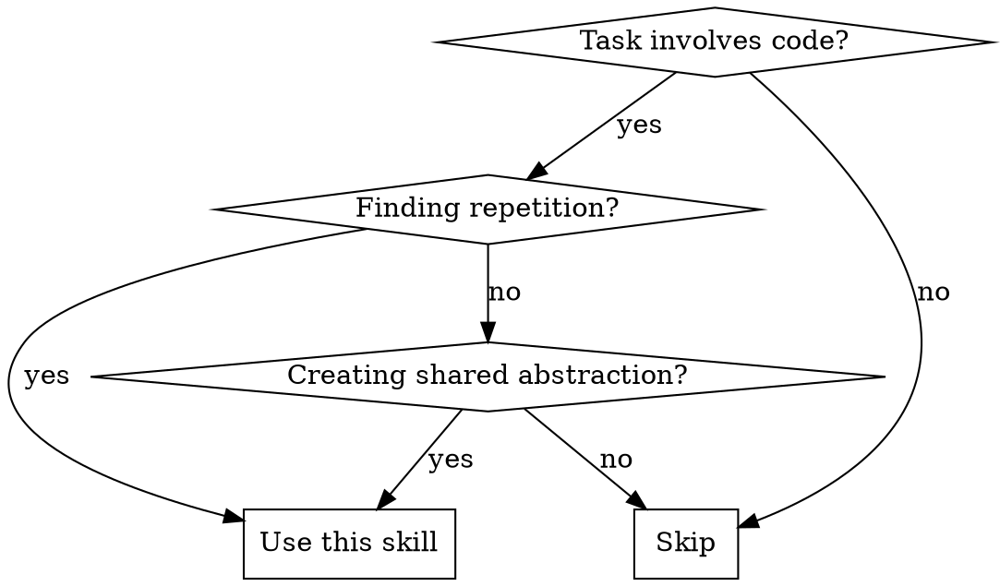
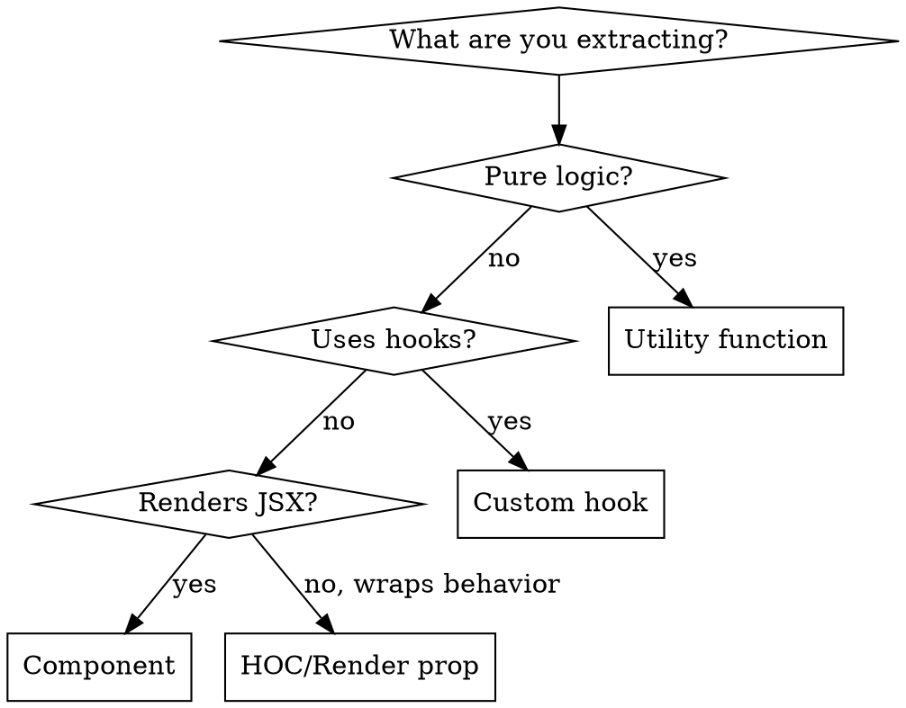

# Finding Duplicate Code

## Overview

Systematic detection of code duplication that warrants extraction to shared layers. Combines automated tooling with semantic analysis to find both obvious and subtle duplicates.

**Core principle:** Duplication worth extracting has three properties: (1) structural similarity, (2) shared intent, (3) positive extraction ROI.

## When to Use



**Use when:**
- Asked to find duplicate/repeated code
- Creating utilities, hooks, or shared components
- Refactoring for DRY compliance
- Auditing codebase quality

**Don't use when:**
- Coincidental similarity (same 3 lines, different purpose)
- Duplication is intentional for clarity
- Extraction cost exceeds benefit

## The Three-Layer Search

### Layer 1: Automated Detection (Find Obvious)

Run static analysis first. **You MUST attempt this step.**

```bash
# jscpd - copy-paste detector (preferred)
npx jscpd ./src --min-lines 5 --reporters consoleFull

# Fallback if jscpd unavailable: structural grep counts
grep -rn "useState.*loading" ./src --include="*.tsx" | wc -l
grep -rn "try {" ./src --include="*.tsx" -A 10 | grep -c "catch"
```

**MANDATORY:** Document what you ran and its output (even if tool unavailable). Don't claim you "did Layer 1" without showing the command and results.

**What automated tools catch:**
- Exact or near-exact copy-paste
- Common patterns (loading/error states, try-catch blocks)
- High-frequency identical structures

**What they miss:**
- Same pattern with different variable names
- Semantically equivalent but structurally different code
- Cross-concern duplication (same logic in different layers)

### Layer 2: Semantic Pattern Search (Find Subtle)

After automated detection, search for conceptual duplicates:

| Conceptual Operation | Search Patterns |
|---------------------|-----------------|
| Async data loading | `useState.*null`, `useEffect.*fetch`, `loading.*error` |
| Entity resolution | `useSelector.*get`, `dispatch.*fetch`, `!entity && id` |
| Form submission | `saving`, `submitting`, `handleSubmit.*async` |
| Modal patterns | `isOpen`, `onClose`, `GenericModal`, `ConfirmModal` |
| List pagination | `page.*setPage`, `nextPage`, `hasMore` |
| Debounced input | `setTimeout`, `clearTimeout`, `debounce` |
| Error boundaries | `try.*catch.*finally`, `setError`, `showError` |

**Semantic analysis checklist:**
1. Find one instance of the pattern
2. Read it to understand the STRUCTURE (not just keywords)
3. Search for the structure with DIFFERENT keywords
4. Compare files side-by-side for equivalence

### Layer 3: Cross-Layer Duplication (Find Hidden)

Check each layer for patterns that should be shared:

| Layer | What to Check |
|-------|--------------|
| **Components** | Similar JSX structures, repeated prop patterns |
| **Hooks** | State + effect combinations, data fetching logic |
| **Selectors** | Derived state calculations, memoization patterns |
| **Actions** | API call + dispatch patterns, error handling |
| **Utils** | Pure functions that could be composed |
| **Tests** | Mock factories, setup patterns, assertion helpers |
| **Styles** | Repeated CSS/SCSS patterns |

## Extraction Decision Matrix

Not all duplication warrants extraction. Evaluate:

| Factor | Extract | Don't Extract |
|--------|---------|---------------|
| **Instances** | 3+ occurrences | 2 occurrences (strict rule) |
| **Stability** | Pattern unlikely to diverge | Might need different behavior |
| **Complexity** | Non-trivial logic | Simple one-liners |
| **Coupling** | Same abstraction level | Different concerns mixed |
| **Naming** | Clear shared name exists | Would be awkward to name |

**The 3+ Rule is strict.** Two instances might just be coincidence. If you only find 2, note it but don't recommend extraction yet. Watch for a third before acting.

**ROI Calculation:**
```
Extraction Value = (instances × complexity × maintenance_risk)
Extraction Cost  = (abstraction_design + migration_effort + test_updates)
Extract if: Value > Cost
```

## Abstraction Layer Selection

Choose the right abstraction type:



## Deliverable Format

When reporting duplicates, provide:

```markdown
## Pattern: [Name]

**Instances found:** [count] files
**Files:** [list with line numbers]

**Canonical example:**
[code block from best example]

**Variations observed:**
- [difference 1]
- [difference 2]

**Recommended abstraction:**
- Type: [util/hook/component]
- Name: `useSomething` or `SomeComponent`
- Location: `src/[path]/`

**Migration complexity:** [Low/Medium/High]
**Extraction priority:** [P0-P3]
```

## Common Mistakes

| Mistake | Fix |
|---------|-----|
| Skipping automated tools | Run jscpd first, always |
| Only finding obvious duplicates | Do semantic analysis in Layer 2 |
| Extracting 2-instance patterns | Wait for 3+ instances |
| Wrong abstraction type | Use flowchart above |
| No migration plan | Note complexity and priority |
| Missing test duplicates | Include test utilities in search |

## Red Flags - You're Cutting Corners

- Only searched for patterns you already knew
- Didn't compare files side-by-side
- Skipped a layer in the codebase
- Found < 3 patterns in a large codebase
- All findings have the same variable names (missed semantic duplicates)
- Didn't show Layer 1 command output
- Recommended extracting 2-instance patterns
- No actual file:line references

## Rationalizations to Reject

| Excuse | Reality |
|--------|---------|
| "jscpd isn't installed" | Run fallback grep commands. Document what you ran. |
| "Only 2 instances but it's obvious" | 3+ rule exists for a reason. Note it, don't extract. |
| "I did Layer 1 mentally" | Show commands and output or you didn't do it. |
| "These two are clearly duplicates" | Clear to you ≠ worth extracting. Need 3+ and ROI. |
| "Side-by-side comparison takes too long" | Read both files. 10 minutes now saves hours later. |
