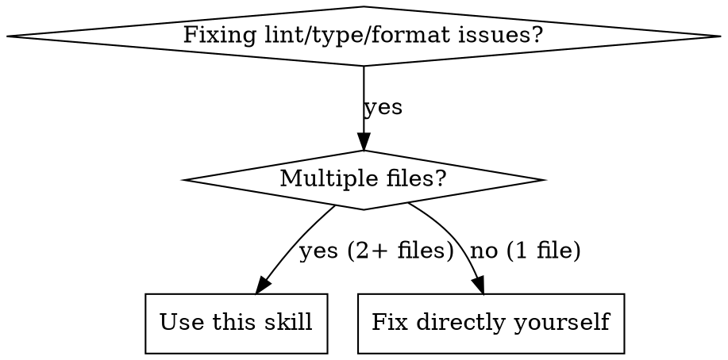

# Parallel Lint Fixes

## Overview

Fix lint/type/format issues (both errors AND warnings) across multiple files. First try auto-fix, then deploy one subagent per file with remaining issues. Parallel subagents prevent context bloat and fix issues faster.

## When to Use



**Symptoms:**
- ESLint/TSC/Prettier/Biome errors across files
- `npm run lint` or similar shows issues in multiple places
- Git pre-commit hook failures
- CI failures due to linting/types

**Don't use for:**
- Single file issues (fix directly)
- Non-lint fixes (refactors, features - use other skills)
- Issues requiring cross-file changes
- max-line / line-length issues (just report - need structural decisions, not mechanical fixes)

## Core Pattern

### Before (Sequential - Slow, Context-Heavy)
```bash
# Agent processes each file itself
eslint src/file1.ts --fix  # read → fix → verify
eslint src/file2.ts --fix  # read → fix → verify
eslint src/file3.ts --fix  # read → fix → verify
```

**Problems:** All file contents in main agent's context. Slow sequential processing.

### After (Parallel Subagents - Fast, Clean)
```bash
# One message dispatches subagents for ALL files
[Subagent 1 → file1.ts]  [Subagent 2 → file2.ts]  [Subagent 3 → file3.ts]
           ↓                        ↓                        ↓
      Fixed independently, verified
```

**Benefits:** Each file processed in isolation. Main context stays clean.

## Quick Reference

| Linter | Command | Notes |
|--------|---------|-------|
| ESLint | `eslint path/to/file --fix` | Run from package directory (fixes errors + warnings) |
| TSC | `tsc --noEmit` | Fix revealed issues (includes warnings) |
| Prettier | `prettier --write path/to/file` | Auto-format |
| Biome | `biome check --write path/to/file` | Lint + format (errors + warnings) |
| Rustfmt | `rustfmt path/to/file` | Auto-format |
| Black | `black path/to/file` | Python formatter |

## Implementation

### Step 1: Try Auto-Fix First

Run the linter with `--fix` on ALL files at once:
```bash
eslint file1.ts file2.ts file3.ts --fix
```

**If ALL issues are resolved:** You're done. Report success.

**If ANY issues remain:** Proceed to Step 2 (subagents).

### Step 1.5: Identify Files Requiring Manual Fixes

Get the list of files with remaining issues:
- Re-run linter after `--fix`
- Identify which files still have errors

**max-line problems:** For line-length issues (e.g., `max-len`, `line-max-length`), do NOT deploy subagents. These require structural refactoring decisions beyond mechanical fixes. Just report them with file paths and line numbers.

### Step 2: Dispatch Subagents (Parallel)

**CRITICAL:** Only proceed here if `--fix` didn't resolve everything.

Send ONE message with ALL subagent launches for files with remaining issues.

```
I'll fix lint issues across all files using parallel subagents.

[Launch subagent for file1.ts]
[Launch subagent for file2.ts]
[Launch subagent for file3.ts]
```

Each subagent gets:
```
Fix all lint issues in {file_path}. Run the linter, identify issues, fix them, and verify the fix passes.
```

### Step 3: Collect Results

Wait for all subagents to complete. Report summary:
- Files fixed successfully
- Files with remaining issues
- Any manual intervention needed

## Iron Rule

**2+ files with lint issues (errors OR warnings) AFTER `--fix`? Deploy subagents. No exceptions.**

**Workflow:**
1. Run `linter --fix` on all files
2. If ALL issues (errors + warnings) resolved → done, report success
3. If ANY issues remain → deploy subagents for those files

This applies regardless of:
- Issue complexity (simple → subagent)
- Number of changes per file (one line → subagent)
- Project setup quirks (subagent handles them)
- How "fast" you think direct fixes would be

**Rationalizations vs Reality**

| Excuse | Reality |
|--------|---------|
| "Issues are straightforward" | Try `--fix` first. If issues remain, subagent handles them fine. |
| "Only one small change per file" | Exactly what subagents are for. Remaining issues = subagents. |
| "Project setup is complex" | Subagent navigates complexity. Your context stays clean. |
| "Direct fixes are faster" | For 3+ files, parallel subagents are faster. You're optimizing wrong metric. |
| "I'll just do it myself" | Did you try `--fix` first? If issues remain, use subagents. |
| "ESLint --fix handles parallelism" | Yes, run `--fix` first. But if issues remain, YOU still read all files. Context bloat. |
| "It's just mechanical fixes" | You still read file contents. Subagents keep YOUR context clean. |
| **"They're just warnings, not errors"** | **Warnings accumulate into bugs. Fix them now. Subagents handle them the same as errors.** |
| **"@ts-ignore is fine here"** | **You're hiding errors. Fix the type properly. Suppressions accumulate into invisible debt.** |
| **"It's a false positive"** | **Maybe. But if you're wrong, you shipped a bug. If right, fix the config, not the code.** |
| **"eslint-disable is temporary"** | **Temporary is permanent. No one comes back to fix it properly.** |
| **"Type assertion is safe"** | **Assertions bypass type safety. They're indistinguishable from "I don't know what type this is."** |

## Common Mistakes

| Mistake | Fix |
|---------|-----|
| Sequential subagents | Launch all in ONE message |
| Running linter from wrong dir | Run from package directory |
| Not verifying fixes | Run linter again after fix |
| Fixing single-file issues | Only use subagents for 2+ files |
| Using for non-lint changes | This skill is for lint/format/type ONLY |
| Ignoring warnings | Warnings are issues too. Fix them like errors. |
| Deploying subagents for max-line issues | Line-length needs structural refactoring decisions, not mechanical fixes. Just report. |
| **Monkey-patching fixes** | **Understand the issue, fix root cause, never suppress** |
| Adding @ts-ignore/eslint-disable | Fix the actual type or logic issue |
| "It's just a quick fix" | Quick fixes accumulate into tech debt |

## Red Flags - Wrong Approach

- Didn't try `--fix` first → Always run `linter --fix` before subagents
- "Let me do file1, then file2..." → Launch all subagents at once
- "I'll read each file first..." → No need, subagent handles it
- "Let me fix this while running the linter..." → Subagent handles each file
- "Issues are simple enough..." → Remaining issues = subagents. Period.
- "Just quick fixes..." → Remaining issues = subagents. Period.
- "ESLint --fix is parallel..." → Yes, use it first. But if issues remain, context bloat.
- "Mostly auto-fixable..." → Did `--fix` clear everything? If not, subagents.
- **"They're just warnings..."** → Warnings are issues. Fix them now or they become bugs.
- **"I'll just add @ts-ignore..."** → You're monkey-patching. Fix the type properly.
- **"Easiest to just eslint-disable..."** → Suppression is not a fix. Fix the code.
- **"It's a false positive anyway..."** → Are you sure? If genuinely wrong, fix the CONFIG, not suppress per-line.
- **"Type assertion is fine here..."** → Assertions hide bugs. Use proper types.
- **"Deploy subagent for max-line..."** → Line-length issues need architectural decisions, not mechanical fixes. Just report them.

## Subagent Template

```text
Fix all lint, type, and formatting issues (errors AND warnings) in {file_path}.

EXCEPTION: Do NOT fix max-line / line-length issues. These require structural refactoring decisions. Report them separately.

CRITICAL: Fix issues PROPERLY, not with monkey-patches.
- Understand WHY the linter is complaining
- Fix the underlying issue, not just the symptom
- Never add @ts-ignore, eslint-disable, or any suppression unless the linter is genuinely wrong
- When fixing type errors, use proper type guards and narrowing - never cast to any
- Treat warnings the same as errors - both need fixing

Steps:
1. Read the file and understand its purpose
2. Run the linter to identify all issues (errors + warnings)
3. For EACH issue:
   a. If it's a max-line/line-length issue: skip it, note for reporting
   b. Otherwise, understand what the rule is checking for and WHY it failed
   c. Determine the PROPER fix (not just the quickest one)
   d. Apply the fix
4. Re-run linter to verify ALL fixable issues (errors + warnings) are resolved
5. Report any issues that genuinely require config changes (not suppression)
6. Report any max-line/line-length issues separately (these need structural decisions)
```

## Proper Fixes vs. Monkey Patches

| Lint Issue | Monkey Patch (❌) | Proper Fix (✅) |
|------------|------------------|-----------------|
| `any` type error | Add `@ts-ignore` or `as any` | Add proper type annotation or type guard |
| Unused variable | Comment it out "just in case" | Remove it or prefix with `_` if intentional |
| Missing dependency | `// eslint-disable-next-line` | Import the missing dependency |
| Complex function | Add `// eslint-disable-line complexity` | Extract helper function or refactor |
| Undefined type | Cast to `unknown` then `any` | Define proper interface or type |
| Rule violation | Add suppressive comment | Fix code to comply with rule |

**Principle:** If you find yourself reaching for a suppression comment, stop. You're probably fixing the wrong problem.

## Real-World Impact

**Before:** Agent processes 20 files sequentially, each file's content added to context. Context bloat leads to truncated history and slower processing.

**After:** 20 parallel subagents, each with clean context. All files fixed simultaneously. Main context stays lean.
