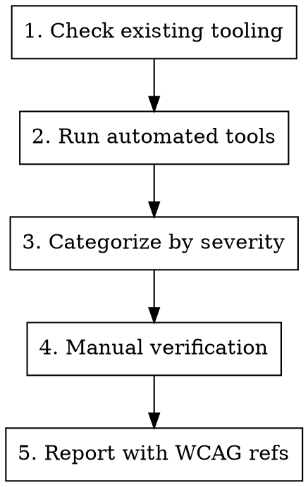

# Accessibility Audit

## Overview

Systematic accessibility auditing using existing tooling before manual inspection. **Always check what a11y tools the project already has before doing manual searches.**

## Methodology



### 1. Check Existing Tooling First

Before manual grep searches, find what's already configured:

```bash
# Check for jsx-a11y in eslint configs
grep -r "jsx-a11y" . --include="*.json" --include="*.js" --include="*.cjs"

# Check package.json for a11y tools
grep -E "jsx-a11y|axe-core|@axe|pa11y|lighthouse" package.json
```

Common tools to look for:
- `eslint-plugin-jsx-a11y` - Static analysis (most React projects have this)
- `@axe-core/react` - Runtime testing
- `pa11y` - CLI accessibility testing
- Lighthouse - Chrome DevTools audit

### 2. Run Automated Tools

**IMPORTANT: Actually run the commands, don't just search for patterns.**

**If jsx-a11y exists (check eslint config):**
```bash
# Run the project's eslint command and filter for a11y issues
# Use the project's configured script (check package.json)
npm run check:eslint 2>&1 | grep -i "jsx-a11y" | head -50

# Or run eslint directly on specific directories
npx eslint src/components --quiet 2>&1 | grep -i "a11y\|aria\|alt\|role" | head -50
```

**If axe-core available:**
```bash
yarn test -- --grep "accessibility"
```

### 3. Categorize by Severity

| WCAG Level | Priority | Examples |
|------------|----------|----------|
| Level A | Critical | Missing alt text, no keyboard access, missing form labels |
| Level AA | Major | Color contrast, focus indicators, heading hierarchy |
| Level AAA | Minor | Sign language, extended audio description |

### 4. Manual Patterns (After Automated)

Only search manually for issues automated tools miss:

```bash
# Role without keyboard support
grep -rn 'role="button"' --include="*.tsx" | head -20

# Interactive elements without focus management
grep -rn 'onClick.*div\|onClick.*span' --include="*.tsx" | head -20

# Missing aria-label on icon-only buttons
grep -rn '<button.*icon\|<IconButton' --include="*.tsx" | head -20
```

### 5. Verification

**Always verify findings are actual issues:**
- Check if component has keyboard handler elsewhere
- Check if aria-label is added dynamically
- Check if parent component provides accessibility context

## Common False Positives

| Pattern | Why It Might Be OK |
|---------|-------------------|
| `<div onClick>` | May have `role="button"` + `onKeyDown` |
| Missing `alt` | May be decorative (`alt=""` or `aria-hidden`) |
| `tabIndex="-1"` | Intentionally removing from tab order for focus management |

## Report Format

```markdown
## Accessibility Audit Report

### Critical (WCAG A)
- [file:line] Issue description - WCAG criterion

### Major (WCAG AA)
- [file:line] Issue description - WCAG criterion

### Recommendations
- Tool improvements (add axe-core, enable more eslint rules)
- Pattern fixes
```

## Anti-Patterns

| Don't | Do Instead |
|-------|------------|
| Grep for patterns without running eslint first | Run `eslint` command, capture actual warnings |
| Search for patterns but not run commands | Actually execute eslint/npm commands |
| Report without verification | Check if issue is real |
| List every warning | Prioritize by WCAG level |
| Skip existing eslint warnings | Many a11y rules are "warn" - still real issues |

## Red Flags

If you find yourself doing these, stop and use automated tools:
- Grepping for `role="button"` without running eslint first
- Manually searching for `onClick` on divs
- Writing long lists of grep commands
- Not actually running any eslint/npm commands
