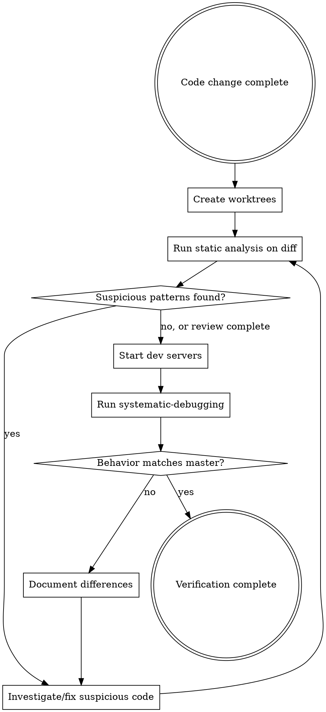

# Compare to Master

## Overview

Compare how `$ARGUMENTS` behaves in your current branch vs master to detect regressions introduced as part of the changes made to this branch.

**Two-phase verification:**
1. **Static Analysis** - Review diff for bug-introducing patterns BEFORE running tests
2. **Behavioral Testing** - Run systematic-debugging with `/dev-browser` on both branches

## Quick Start

```bash
/compare-to-master compare how <feature> behaves after changes in this branch vs master
```

## The Verification Flow



## Process

### Phase 1: Create Worktrees

```bash
# Master worktree - only create if not exists
if [ ! -d "../blok-master" ]; then
  git worktree add ../blok-master master
fi

# Comparison branch worktree - create a branch off current branch
# Use $ARGUMENTS for branch name, or default to timestamp name
CURRENT_BRANCH=$(git branch --show-current)
COMPARE_BRANCH="${1:-compare-$(date +%s)}"
COMPARE_WORKTREE="../blok-$(echo $COMPARE_BRANCH | sed 's/\//-/g')"
if [ ! -d "$COMPARE_WORKTREE" ]; then
  # Create new branch from current branch in worktree
  git worktree add -b "$COMPARE_BRANCH" "$COMPARE_WORKTREE" "$CURRENT_BRANCH"
fi
```

### Phase 2: Static Code Analysis

**BEFORE starting dev servers**, analyze the diff for bug-introducing patterns:

```bash
cd ../blok-master
git diff ../blok
```

**Check for these bug-introducing patterns:**

| Pattern | Why It's Risky | Examples |
|---------|----------------|----------|
| **Removed validation** | May allow invalid state | `delete` calls, removed `if` guards, removed error throws |
| **Changed return values** | Callers may expect specific shape | `return` statements changed, optional chaining added to required values |
| **Modified event emissions** | Other modules depend on these | `emit`, `dispatch`, events with different payloads |
| **Altered async flow** | Race conditions, timing issues | `async/await` removed/added, `Promise` handling changed |
| **Moved/renamed exports** | Importers will break | `export` statements changed |
| **Type coercion introduced** | Runtime type errors | `as any`, `@ts-ignore`, `!` assertions |
| **Changed loop/mutation logic** | Off-by-one, state corruption | `for` loops, `forEach`, array methods, direct mutations |
| **Modified dependencies** | Breaking changes from libs | `package.json` deps changed, version bumps |
| **Deleted/moved tests** | Coverage loss | Files in `test/` removed/renamed |
| **Changed error handling** | Swallowed errors, wrong catch blocks | `try/catch` modified, error handlers changed |

**Analysis checklist:**
- [ ] No validation removed without replacement
- [ ] All public API return values maintain shape
- [ ] Event emissions preserve existing signatures
- [ ] Async operations maintain proper sequencing
- [ ] No `@ts-ignore`, `any`, or `!` introduced
- [ ] Tests preserved or expanded

**If suspicious patterns found:** Fix BEFORE proceeding to behavioral testing. Static analysis catches bugs tests miss.

### Phase 3: Start Dev Servers

```bash
# Terminal 1 - Master
cd ../blok-master && yarn serve

# Terminal 2 - Comparison branch (off current branch)
cd "$COMPARE_WORKTREE" && yarn serve
```

The dev server will automatically find an available port (330*)

### Phase 4: Behavioral Testing

Use `/dev-browser` for systematic debugging:
- Check terminal output for actual ports assigned
- Master: typically http://localhost:330*/
- Comparison branch: typically http://localhost:330*/

### Phase 5: Document Differences

Record any behavioral differences found, even if tests pass. Silent bugs are the most dangerous.

## Common Mistakes

| Mistake | Fix |
|---------|-----|
| Skipping static analysis | Always analyze diff BEFORE running tests |
| Only checking if tests pass | Tests can pass while bugs exist (wrong behavior tested) |
| Ignoring suspicious patterns | "Looks fine" is not analysis - use the pattern checklist |
| Not reviewing deleted code | Deletions can remove critical validation |
| Assuming "no diff means safe" | Still test - behavior can change without visible diff |
| Recreating master worktree every time | Use existence check - master persists across sessions |
| Hardcoding branch name | Use `git branch --show-current` dynamically |
| Assuming specific ports | Check terminal output - dev server auto-selects ports |

## Red Flags - You're About to Violate The Rules

If you catch yourself thinking ANY of these, STOP:

- "Static analysis takes too long, I'll just run tests"
- "The diff looks fine, I don't need a checklist"
- "Tests cover it, no need to review the code"
- "I only changed one file, analysis is overkill"
- "Deleted code was dead anyway, no need to review"
- "That validation was redundant, removing it is fine"
- "I'll catch any issues in behavioral testing"

**All of these mean: You're skipping analysis. Run the checklist NOW.**

## Cleanup

```bash
# Keep master for reuse
# Remove comparison branch worktree when done
git worktree remove "$COMPARE_WORKTREE"
git branch -D "$COMPARE_BRANCH"
```

## The Bottom Line

**Two-phase verification is mandatory.**
1. Static analysis catches bugs tests miss
2. Behavioral testing catches issues analysis misses

Skipping either phase means unverified code.
