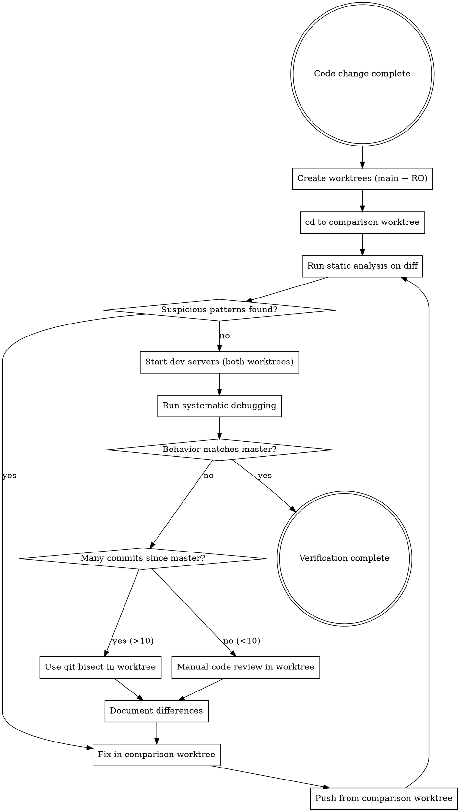

# Compare to Master

## Overview

Compare how `$ARGUMENTS` behaves in your current branch vs master to detect regressions introduced as part of the changes made to this branch.

**IRON RULE: ALL verification and fixes happen in the ISOLATED worktree.**
- Main workspace READ-ONLY after worktree creation
- Master worktree READ-ONLY (baseline reference only)
- Comparison worktree is where ALL investigation, testing, and fixes occur

**Two-phase verification (in isolated worktree):**
1. **Static Analysis** - Review diff for bug-introducing patterns BEFORE running tests
2. **Behavioral Testing** - Run systematic-debugging with `/dev-browser` on both branches
3. **Fix in Isolation** - Apply fixes in comparison worktree, push from there

## Quick Start

```bash
/compare-to-master compare how <feature> behaves after changes in this branch vs master
```

## The Verification Flow



## Process

### Phase 0: Workspace Lockout

**CRITICAL: Before creating worktrees, LOCK the main workspace.**

```bash
# Get repo name from current directory
REPO_NAME=$(basename "$(pwd)")

# Create unique session ID for parallel sessions
SESSION_ID="${REPO_NAME}-compare-$(date +%s)-$$"
SESSION_FILE="~/.compare-to-master-${SESSION_ID}.tmp"

# Store workspace paths in session file
MAIN_WORKSPACE=$(pwd)
MASTER_WORKTREE="../${REPO_NAME}-master"
CURRENT_BRANCH=$(git branch --show-current)
COMPARE_BRANCH="compare-$(date +%s)"
COMPARE_WORKTREE="../${REPO_NAME}-${COMPARE_BRANCH}"

# Persist for verification (unique file per session)
cat > "$SESSION_FILE" << EOF
MAIN_WORKSPACE=$MAIN_WORKSPACE
MASTER_WORKTREE=$MASTER_WORKTREE
COMPARE_WORKTREE=$COMPARE_WORKTREE
COMPARE_BRANCH=$COMPARE_BRANCH
READONLY_LOCKED=1
SESSION_ID=$SESSION_ID
EOF

# Also create a symlink for easy access (uses session ID in target to avoid conflicts)
ln -sf "$SESSION_FILE" ~/.compare-to-master-session-active
```

**From this point forward:**
- Main workspace is READ-ONLY
- NO edits in main workspace
- NO git commands in main workspace
- ALL work happens in comparison worktree

### Phase 1: Create Worktrees

```bash
# Master worktree - only create if not exists
if [ ! -d "$MASTER_WORKTREE" ]; then
  git worktree add "$MASTER_WORKTREE" master
fi

# Comparison branch worktree - create a branch off current branch
if [ ! -d "$COMPARE_WORKTREE" ]; then
  git worktree add -b "$COMPARE_BRANCH" "$COMPARE_WORKTREE" "$CURRENT_BRANCH"
fi

# IMMEDIATELY cd to comparison worktree
cd "$COMPARE_WORKTREE"
# You are now in the isolated worktree - ALL work happens here
```

**Verify you're in the right place:**
```bash
pwd  # Should show path ending in $COMPARE_WORKTREE
git branch --show-current  # Should show $COMPARE_BRANCH
ls ~/.compare-to-master-${SESSION_ID}.tmp  # Verify session file exists
```

### Phase 2: Static Code Analysis

**BEFORE starting dev servers**, analyze the diff for bug-introducing patterns:

```bash
# From comparison worktree, diff against master
git diff "$MASTER_WORKTREE"
```

**NOTICE: The diff command runs FROM the comparison worktree.**

**Check for these bug-introducing patterns:**

| Pattern | Why It's Risky | Examples |
|---------|----------------|----------|
| **Removed validation** | May allow invalid state | `delete` calls, removed `if` guards, removed error throws |
| **Changed return values** | Callers may expect specific shape | `return` statements changed, optional chaining added to required values |
| **Modified event emissions** | Other modules depend on these | `emit`, `dispatch`, events with different payloads |
| **Altered async flow** | Race conditions, timing issues | `async/await` removed/added, `Promise` handling changed |
| **Moved/renamed exports** | Importers will break | `export` statements changed |
| **Type coercion introduced** | Runtime type errors | `as any`, `@ts-ignore`, non-null assertions |
| **Changed loop/mutation logic** | Off-by-one, state corruption | `for` loops, `forEach`, array methods, direct mutations |
| **Modified dependencies** | Breaking changes from libs | `package.json` deps changed, version bumps |
| **Deleted/moved tests** | Coverage loss | Files in `test/` removed/renamed |
| **Changed error handling** | Swallowed errors, wrong catch blocks | `try/catch` modified, error handlers changed |

**Analysis checklist:**
- [ ] No validation removed without replacement
- [ ] All public API return values maintain shape
- [ ] Event emissions preserve existing signatures
- [ ] Async operations maintain proper sequencing
- [ ] No `@ts-ignore`, `any`, or non-null introduced
- [ ] Tests preserved or expanded

**If suspicious patterns found:** Fix in the comparison worktree BEFORE proceeding to behavioral testing.

```bash
# Fix in comparison worktree (where you already are)
vim src/file-with-issue.ts  # or your editor of choice

# After fixing, verify the fix
git diff  # Shows your fix in comparison worktree

# Commit and push FROM comparison worktree
git commit -m "fix: address suspicious pattern found during static analysis"
git push origin "$COMPARE_BRANCH"
```

**Static analysis catches bugs tests miss. Fix them here, now.**

**Verification checkpoint:** Confirm you're still in the right place
```bash
# Load session variables if needed (use your unique SESSION_ID)
source ~/.compare-to-master-${SESSION_ID}.tmp 2>/dev/null || echo "Session file missing!"

pwd | grep -q "$(basename "$COMPARE_WORKTREE")" && echo "✓ In comparison worktree ($SESSION_ID)" || echo "✗ WRONG WORKSPACE"
```

### Phase 3: Start Dev Servers

```bash
# Terminal 1 - Master (baseline reference)
cd "$MASTER_WORKTREE" && yarn serve

# Terminal 2 - Stay in comparison worktree, start server there
# (You should already be in $COMPARE_WORKTREE from Phase 1)
yarn serve
```

The dev server will automatically find an available port (330*)

### Phase 4: Behavioral Testing

**Run `/dev-browser` from the comparison worktree.**

Use `/dev-browser` for systematic debugging:
- Check terminal output for actual ports assigned
- Master: typically http://localhost:330*/
- Comparison branch: typically http://localhost:330*/

**Verification checkpoint:** Confirm you're still in the right place
```bash
# Load session variables if needed (use your unique SESSION_ID)
source ~/.compare-to-master-${SESSION_ID}.tmp 2>/dev/null || echo "Session file missing!"

pwd | grep -q "$(basename "$COMPARE_WORKTREE")" && echo "✓ In comparison worktree ($SESSION_ID)" || echo "✗ WRONG WORKSPACE"
```

**If differences are found, fix them in the comparison worktree:**
```bash
# You are already in comparison worktree
# Fix the issue
vim src/broken-file.ts

# Verify the fix
git diff

# Commit and push FROM comparison worktree
git commit -m "fix: behavioral issue found during comparison"
git push origin "$COMPARE_BRANCH"

# Re-test after fix
```

### Phase 5: Document Differences

Record any behavioral differences found in the comparison worktree, even if tests pass. Silent bugs are the most dangerous.

```bash
# Create documentation in comparison worktree
cat > REGRESSION_NOTES.md << 'EOF'
# Regression Found During Comparison

## Difference
[Describe the behavioral difference]

## Expected (master)
[What master does]

## Actual (comparison branch)
[What comparison branch does]

## Suspected commit
[Which commit likely caused this]
EOF
```

**When differences are found and you have many commits (>10) since master, use git bisect IN THE COMPARISON WORKTREE to pinpoint the exact commit:**

**Verification checkpoint before bisect:** Confirm you're still in the right place
```bash
pwd | grep -q "$(basename "$COMPARE_WORKTREE")" && echo "✓ In comparison worktree" || echo "✗ WRONG WORKSPACE"
```

### Git Bisect for Regression Hunting

**ALL bisect commands run IN THE COMPARISON WORKTREE.**

```bash
# You should still be in comparison worktree
pwd  # Verify: should be $COMPARE_WORKTREE

# 1. Start bisect in comparison worktree
git bisect start

# 2. Mark current (broken) state
git bisect bad

# 3. Mark master (working) state - reference to master worktree
git bisect good "$MASTER_WORKTREE"

# 4. Git will checkout a midpoint commit in comparison worktree. Test it:
# - Build and serve: yarn build && yarn serve
# - Run your systematic-debugging test via /dev-browser
# - Mark result: git bisect good (works) or git bisect bad (broken)

# 5. Repeat until git identifies the culprit commit
# Bisect will show: "first bad commit is <sha>"

# 6. Reset when done (STILL in comparison worktree)
git bisect reset
```

**Automated bisect with a test script (in comparison worktree):**

```bash
# Create a script that returns 0 for good, 1 for bad
cat > test-regression.sh << 'EOF'
#!/bin/bash
yarn build > /dev/null 2>&1 || exit 1
yarn serve > /dev/null 2>&1 &
SERVE_PID=$!
sleep 5
# Add your /dev-browser test here or use curl/puppeteer
# Test passes → exit 0, fails → exit 1
kill $SERVE_PID 2>/dev/null
EOF
chmod +x test-regression.sh

# Run automated bisect (from comparison worktree)
git bisect run ./test-regression.sh
```

**When bisect finds the culprit, fix it in comparison worktree:**
```bash
# You're in comparison worktree, bisect checked out the bad commit
# Create fix branch from here
BAD_COMMIT=$(git log --format=%h -1)
git checkout -b "fix-${BAD_COMMIT}"

# Fix the issue
vim src/broken-file.ts

# Commit and push FROM comparison worktree
git commit -m "fix: regression found via bisect"
git push origin "fix-${BAD_COMMIT}"

# Return to comparison branch
git checkout "$COMPARE_BRANCH"

# Cherry-pick the fix or merge the fix branch
git merge "fix-${BAD_COMMIT}"
git push origin "$COMPARE_BRANCH"
```

**When to use bisect vs manual review:**
- Use bisect: >10 commits, complex refactor, unclear which change caused issue
- Manual review: <10 commits, obvious candidate, need quick answer

## Common Mistakes

| Mistake | Fix |
|---------|-----|
| Fixing issues in main workspace | ALL fixes happen in comparison worktree |
| Running git commands from main workspace | cd to comparison worktree, run everything there |
| Forgetting which worktree you're in | Run `pwd` and `git branch --show-current` to verify |
| Losing track of your SESSION_ID | Use `ls ~/.compare-to-master-*.tmp` to find all sessions |
| Mixing up parallel sessions | Each session has unique SESSION_ID in file name and verification output |
| Pushing from main workspace | Push from comparison worktree after fixes |
| Skipping static analysis | Always analyze diff BEFORE running tests |
| Only checking if tests pass | Tests can pass while bugs exist (wrong behavior tested) |
| Ignoring suspicious patterns | "Looks fine" is not analysis - use the pattern checklist |
| Not reviewing deleted code | Deletions can remove critical validation |
| Assuming "no diff means safe" | Still test - behavior can change without visible diff |
| Recreating master worktree every time | Use existence check - master persists across sessions |
| Hardcoding branch name | Use `git branch --show-current` dynamically |
| Assuming specific ports | Check terminal output - dev server auto-selects ports |
| Manual review for 50+ commits | Use git bisect - O(log n) vs O(n) search |
| Forgetting to `git bisect reset` | Always reset after bisect to return to original branch |
| Inconsistent bisect testing | Use same test method at each commit - script it for reliability |
| Running bisect in main workspace | Run bisect in comparison worktree ONLY |

## Red Flags - You're About to Violate The Rules

If you catch yourself thinking ANY of these, STOP:

- "I'll just fix this in the main workspace, it's quicker"
- "The worktree is just for reference, I'll fix here"
- "I need to run git status in the main directory"
- "I'll push from main after fixing"
- "Static analysis takes too long, I'll just run tests"
- "The diff looks fine, I don't need a checklist"
- "Tests cover it, no need to review the code"
- "I only changed one file, analysis is overkill"
- "Deleted code was dead anyway, no need to review"
- "That validation was redundant, removing it is fine"
- "I'll catch any issues in behavioral testing"

**All of these mean: You're violating workspace isolation or skipping analysis.**

**Main workspace violations:** cd to comparison worktree immediately.
**Analysis violations:** Run the checklist NOW.

## Cleanup

**ONLY after ALL fixes are pushed and verified:**

```bash
# Verify: load your unique session variables first
source ~/.compare-to-master-${SESSION_ID}.tmp 2>/dev/null || {
  echo "Session file not found. Find it with: ls ~/.compare-to-master-*.tmp"
  exit 1
}

# You should still be in comparison worktree
# Verify all work is complete:
# 1. All fixes committed and pushed
# 2. Behavior matches master
# 3. REGRESSION_NOTES.md created (if differences found)

git status  # Should show "nothing to commit, working tree clean"

# Keep master for reuse
# Remove comparison branch worktree when done
cd ..  # Exit comparison worktree first
git worktree remove "$COMPARE_WORKTREE"
git branch -D "$COMPARE_BRANCH"

# Unlock main workspace - remove YOUR session file only
rm ~/.compare-to-master-${SESSION_ID}.tmp
rm -f ~/.compare-to-master-session-active  # May fail if another session owns it now

# Return to main workspace
cd "$MAIN_WORKSPACE"
```

**Finding your session if you lost track:**
```bash
# List all active comparison sessions
ls -la ~/.compare-to-master-*.tmp 2>/dev/null || echo "No active sessions"

# Read a specific session
cat ~/.compare-to-master-REPONAME-compare-TIMING-PID.tmp
```

**Do NOT clean up if:**
- Fixes are not pushed
- Tests are failing
- Behavior still differs from master
- REGRESSION_NOTES.md is not committed

## The Bottom Line

**Workspace isolation is MANDATORY.**
1. Main workspace goes READ-ONLY after worktree creation
2. ALL verification happens in comparison worktree
3. ALL fixes happen in comparison worktree
4. ALL pushes happen from comparison worktree

**Two-phase verification in isolation:**
1. Static analysis catches bugs tests miss
2. Behavioral testing catches issues analysis misses
3. Fix-in-isolation prevents polluting main workspace with experimental changes

**Skipping isolation or either phase means unverified code.**
