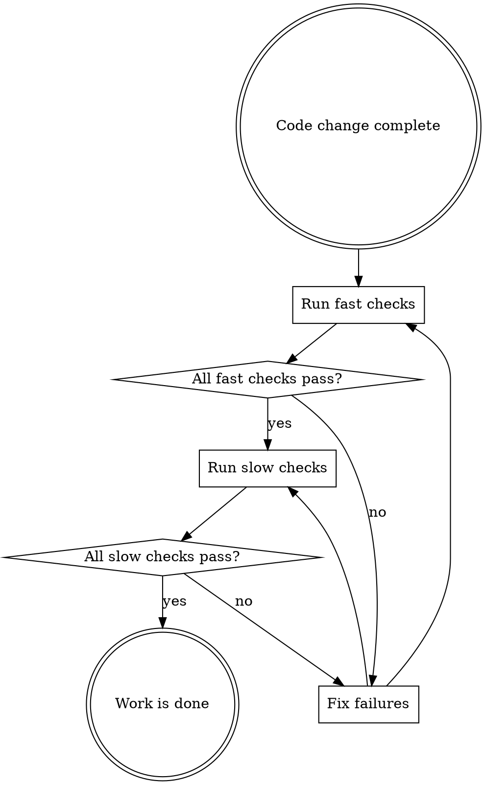

# Verify Nothing Broken

## Overview

**Never claim work is complete without running ALL verification checks.**

Partial verification = no verification. If lint passes but tests fail, you broke something. If tests pass but build fails, you broke something. If build passes but E2E fails, you broke something.

**All checks must pass.**

### The Iron Law

**Work is NOT done until ALL checks pass.**

Not "mostly done." Not "done except for that one failing test." Not "done but I need to verify later."

**Done means verified.**

## The Verification Flow



## Complete Verification (Run After EVERY Code Change)

```bash
yarn lint                    # Type checking + ESLint
yarn test                    # Unit tests
yarn build                   # Production build
yarn build:test && yarn e2e  # E2E tests
```

**All commands must exit with code 0. Any failure = work is NOT done.**

## When To Run

| Check | Command | Run When |
|-------|---------|----------|
| Lint | `yarn lint` | Every change |
| Unit Tests | `yarn test` | Every change |
| Build | `yarn build` | Every change |
| E2E Tests | `yarn build:test && yarn e2e` | Every change |

**No exceptions.** Small changes, refactors, formatting-only changes - ALL require full verification.

## Handling Failures

When a check fails:

1. **STOP** - Don't continue with other checks
2. **Read the error** - Understand what broke
3. **Fix the root cause** - Don't suppress errors
4. **Re-run the failed check** - Verify the fix
5. **Continue the sequence** - Only after fixing

**Don't suppress errors. Don't commit "WIP" with failing checks. Don't declare "good enough."**

## Rationalization Reality Check

| Thought | Reality |
|---------|---------|
| "It's only 10 lines" | 10 lines can break the entire build |
| "Just extracted a function" | Moving code breaks imports, exports |
| "No logic changed" | Formatting changes can break parsers |
| "That module isn't related" | Everything is related in a codebase |
| "User is waiting" | Broken code delivered fast = angry user |
| "I'll verify later" | You won't. Or you'll forget what changed. |
| "Tests take too long" | Debugging broken code takes longer. |
| "It's just a refactor" | Refactors break production code. |

## Red Flags - STOP and Verify

You are rationalizing if you think ANY of these:

- "It's just a small refactor"
- "Unit tests cover this, E2E is overkill"
- "Build will be fine, lint passed"
- "I'll run E2E before the PR"
- "This change can't possibly affect X"
- "The failure is unrelated to my change"
- "Just moved code around, no logic changed"
- "This is only formatting"
- "I didn't touch that file/module"
- "User is in a hurry"
- "Tests are too slow, I'll skip them"
- "Let me just check one thing quickly"

**All of these mean: Run the full verification suite.**

## Project-Specific Notes

For the blok project specifically:

- **E2E tests load from `dist/`** - Always run `yarn build:test` before E2E
- **`yarn lint` runs both TypeScript + ESLint** - Both must pass
- **Size limits enforced** - Build may fail if bundle exceeds limits

## The Bottom Line

**No exceptions. No rationalizations. No shortcuts.**

If you modified code, you must verify nothing broke. Verification is not optional - it's part of completing the work.

### Violating the Letter is Violating the Spirit

Don't look for loopholes. Don't argue about what "really needs" verification. Don't decide some checks don't apply to your situation.

**The rules exist because they prevent bugs. Follow them.**
