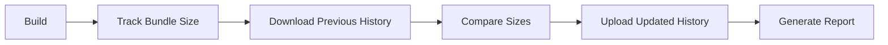
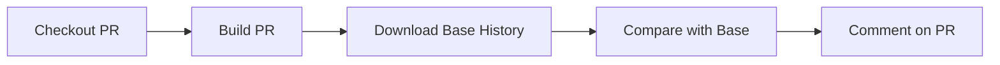

# Bundle Size Trend Tracking - Implementation Summary

## What Was Implemented

A comprehensive bundle size tracking system that monitors size changes over time without hard limits, replacing the previous approach of rigid size constraints.

## Key Features

### 1. Historical Size Tracking
- **Automatic tracking** on every release via GitHub Actions
- **90-day retention** of historical data in GitHub artifacts
- **Trend analysis** to detect gradual bloat
- **Percentage-based alerts** instead of hard limits (10% threshold)

### 2. Pull Request Integration
- **Automatic PR comments** with bundle size comparisons
- **5% threshold** for PR checks (more sensitive than releases)
- **Baseline comparison** against base branch
- **Visual reports** in markdown format

### 3. Local Development Tools
- **CLI tools** for tracking and viewing history
- **Trend visualization** in terminal
- **CSV export** for advanced analysis
- **No git pollution** - history stored in artifacts only

## Files Created

### Scripts
- [`scripts/track-bundle-size.mjs`](scripts/track-bundle-size.mjs) - Main tracking script
- [`scripts/view-bundle-trends.mjs`](scripts/view-bundle-trends.mjs) - History viewer and trend analyzer
- [`scripts/README.md`](scripts/README.md) - Scripts documentation

### Workflows
- [`.github/workflows/bundle-size-check.yml`](.github/workflows/bundle-size-check.yml) - PR bundle size checks

### Documentation
- [`docs/bundle-size-tracking.md`](docs/bundle-size-tracking.md) - Comprehensive documentation
- [`BUNDLE_SIZE_TRACKING_SUMMARY.md`](BUNDLE_SIZE_TRACKING_SUMMARY.md) - This file

## Files Modified

### Workflows
- [`.github/workflows/release.yml`](.github/workflows/release.yml)
  - Added bundle size tracking after build
  - Downloads/uploads historical data from artifacts
  - Generates comparison reports

### Configuration
- [`package.json`](package.json)
  - Added `bundle:track` script
  - Added `bundle:history` script
  - Added `bundle:trends` script

- [`.gitignore`](.gitignore)
  - Excluded `.bundle-size-history.json`
  - Excluded `bundle-size-*.md` reports

### Verification
- [`scripts/verify-package/checks/bundle-size.mjs`](scripts/verify-package/checks/bundle-size.mjs)
  - Updated comments to clarify limits are reference values
  - Added pointer to new tracking system

## How It Works

### 1. On Each Release



1. **Build** - Create production bundles
2. **Track** - Measure all bundle sizes
3. **Download** - Get previous history from artifacts
4. **Compare** - Calculate changes and percentages
5. **Upload** - Store updated history (90-day retention)
6. **Report** - Generate markdown reports (30-day retention)

### 2. On Pull Requests



1. **Checkout** - Get PR code
2. **Build** - Create PR bundles
3. **Download** - Get base branch history
4. **Compare** - Calculate differences (5% threshold)
5. **Comment** - Post comparison as PR comment

### 3. Local Development

```bash
# Track current build
yarn build
yarn bundle:track

# View history
yarn bundle:history

# View trends
yarn bundle:trends
```

## Data Format

Historical data is stored in `.bundle-size-history.json`:

```json
{
  "timestamp": "2025-12-18T10:30:00.000Z",
  "commit": "abc123def",
  "version": "0.4.1",
  "bundles": {
    "blok.umd.js": 245678,
    "blok.mjs": 4567,
    "blok-DrcGT5U0.mjs": 829560,
    "locales.mjs": 6700,
    "locales.umd.js": 7650,
    "_total": 1630000
  },
  "comparison": {
    "hasSignificantChange": true,
    "totalChange": 5.2,
    "alerts": [
      "⚠️ blok.umd.js increased by 12.5% (245 KB → 275 KB)"
    ]
  }
}
```

## Tracked Bundles

| Bundle | Description |
|--------|-------------|
| `blok.umd.js` | UMD bundle entry point |
| `blok.mjs` | ES module entry point |
| `blok-*.mjs` | Main code chunk |
| `locales.mjs` | Locales entry point |
| `locales.umd.js` | Locales UMD bundle |
| `locales-*.mjs` | Locales chunk |
| `_total` | Total dist directory size |

## Alert Thresholds

| Context | Threshold | Rationale |
|---------|-----------|-----------|
| **Release** | 10% | Allows for feature growth while catching significant changes |
| **PR** | 5% | More sensitive to catch smaller changes during development |

## Comparison with Previous Approach

### Old: Hard Limits ❌

```javascript
const limits = {
  'blok.umd.js': 800 * 1024, // Hard 800KB limit
  'blok.mjs': 5 * 1024,      // Hard 5KB limit
};

if (size > limit) {
  throw new Error('Bundle too large!');
}
```

**Problems:**
- Blocks legitimate feature additions
- Doesn't detect gradual bloat within limits
- Arbitrary limits disconnected from actual needs
- Manual updates required

### New: Trend Tracking ✅

```javascript
const percentageChange = ((current - previous) / previous) * 100;

if (percentageChange > threshold) {
  console.warn(`⚠️ Size increased by ${percentageChange}%`);
  // But don't fail - just warn
}
```

**Benefits:**
- Detects gradual bloat automatically
- Provides historical context
- Never blocks builds (warnings only)
- No manual configuration needed
- Tracks actual trends over time

## Usage Examples

### View Recent History

```bash
$ yarn bundle:history

Bundle Size History
════════════════════════════════════════════════════════════════

📅 12/18/2025, 4:12:42 AM | Commit: abc123 | Version: 0.4.1
────────────────────────────────────────────────────────────────
  blok-DrcGT5U0.mjs               810.12 KB
  locales.umd.js                    7.47 KB
  locales.mjs                       6.55 KB
  blok.umd.js                          74 B
  blok.mjs                             73 B
  ──────────────────────────────────────────
  Total                             1.63 MB
```

### View Trends

```bash
$ yarn bundle:trends

Trend Analysis (First → Last)
════════════════════════════════════════════════════════════════
⚠️  blok-DrcGT5U0.mjs  810 KB → 850 KB (+40 KB / +4.9%)
➡️  locales.umd.js     7.47 KB → 7.50 KB (+30 B / +0.4%)
✅ _total              1.63 MB → 1.60 MB (-30 KB / -1.8%)
```

### Export for Analysis

```bash
$ node scripts/view-bundle-trends.mjs --csv=sizes.csv
✓ Exported to sizes.csv
```

## PR Comment Example

When a PR changes bundle sizes, an automatic comment appears:

> # Bundle Size Report
>
> ## Alerts
>
> - ⚠️ blok-DrcGT5U0.mjs increased by 6.2% (810 KB → 860 KB)
>
> ## Current Bundle Sizes
>
> | Bundle | Size | Previous | Change |
> |--------|------|----------|--------|
> | blok-DrcGT5U0.mjs | 860 KB | 810 KB | +50 KB (+6.2%) |
> | blok.umd.js | 74 B | 74 B | 0 B (0.0%) |
> | blok.mjs | 73 B | 73 B | 0 B (0.0%) |
> | locales.mjs | 6.55 KB | 6.55 KB | 0 B (0.0%) |
> | locales.umd.js | 7.47 KB | 7.47 KB | 0 B (0.0%) |
> | _total | 1.68 MB | 1.63 MB | +50 KB (+3.1%) |
>
> > ⚠️ Significant size changes detected (>5% threshold)
>
> ---
> *Automated bundle size tracking*

## Configuration Options

### Tracking Script Options

```bash
node scripts/track-bundle-size.mjs [options]

Options:
  --verbose, -v          Show detailed output
  --output=FILE          Generate markdown report
  --threshold=N          Alert threshold percentage (default: 10)
  --max-entries=N        Max history entries (default: 100)
```

### History Viewer Options

```bash
node scripts/view-bundle-trends.mjs [options]

Options:
  --trends, -t           Show trend analysis
  --limit=N              Show last N entries (default: 10)
  --csv=FILE             Export data to CSV
```

## Retention Policies

| Artifact Type | Retention | Location |
|--------------|-----------|----------|
| Release history | 90 days | GitHub Actions artifacts |
| Release reports | 30 days | GitHub Actions artifacts |
| PR data | 7 days | GitHub Actions artifacts |
| Local history | Until deleted | `.bundle-size-history.json` (gitignored) |

## Best Practices

1. **Review trends regularly** - Run `yarn bundle:trends` weekly
2. **Investigate significant changes** - Don't ignore alerts
3. **Document intentional increases** - Add context in PRs
4. **Export for deep analysis** - Use CSV export for spreadsheet analysis
5. **Don't fail builds** - Use warnings, not errors

## Troubleshooting

### "No history file found"

**Solution:** Run your first build and track:
```bash
yarn build
yarn bundle:track
```

### "No baseline data available" (in PR)

**Cause:** First PR after setup, no previous releases

**Solution:** Wait for first release to run, which creates the baseline

### "Failed to download artifact"

**Causes:**
- No previous release
- Artifact expired (>90 days)
- Workflow permissions issue

**Solution:** Run a release to create initial baseline

## Future Enhancements

Potential improvements:

1. **Charts & Graphs** - Visual trend charts in reports
2. **Per-Tool Tracking** - Track individual tool bundle sizes
3. **Regression Detection** - ML-based anomaly detection
4. **Optimization Suggestions** - Automated code splitting recommendations
5. **Benchmark Comparison** - Compare with similar packages
6. **Size Budget Recommendations** - AI-suggested realistic budgets

## Migration from Hard Limits

The old hard limits are still present in `scripts/verify-package/checks/bundle-size.mjs` but now labeled as "reference values" and don't block builds. They're kept for informational purposes only.

To fully migrate:

1. ✅ New tracking system installed and configured
2. ✅ GitHub Actions workflows updated
3. ✅ PR workflow added for automatic checks
4. ✅ Documentation created
5. ⏳ Wait for first release to create baseline
6. ⏳ Monitor trends over next few releases
7. ⏳ Consider removing hard limits entirely after validation

## Documentation

- **Full guide:** [`docs/bundle-size-tracking.md`](docs/bundle-size-tracking.md)
- **Scripts guide:** [`scripts/README.md`](scripts/README.md)
- **Development guide:** [`CLAUDE.md`](CLAUDE.md)

## Testing

The implementation has been tested locally:

```bash
✓ Build successful
✓ Bundle tracking works
✓ History storage works
✓ Trend analysis works
✓ Report generation works
✓ YAML workflows validated
```

## Next Steps

1. **Commit changes** to the `chore/publishing` branch
2. **Merge to master** to enable tracking
3. **Run first release** to create baseline
4. **Monitor PR comments** on future PRs
5. **Review trends** after a few releases

## Questions?

Refer to the comprehensive documentation in [`docs/bundle-size-tracking.md`](docs/bundle-size-tracking.md) or open an issue.

---

**Status:** ✅ Implementation Complete

**Created:** 2025-12-18

**Version:** 1.0
