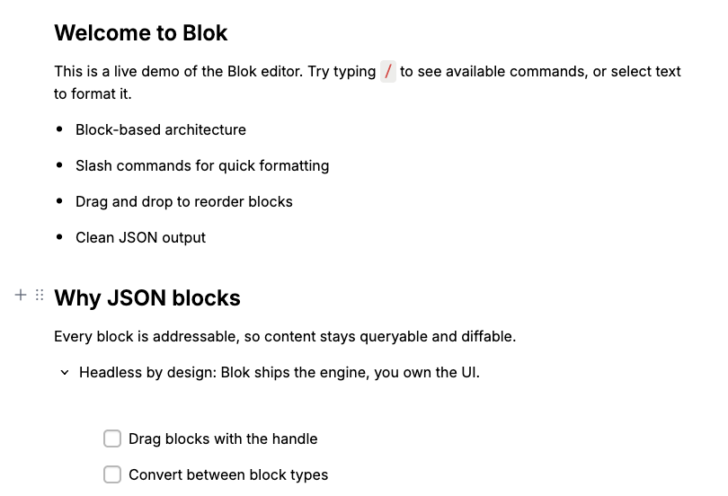

<p align="center">
  <a href="https://blokeditor.com" target="_blank" rel="noopener noreferrer">
    
  </a>
</p>

# Blok

A block-based rich text editor for the web, like the one in Notion: every paragraph, heading, image or list is its own block you can drag, nest, and convert into something else.

The difference from a plain `contenteditable` field is what you get back. `contenteditable` hands you one HTML blob and leaves you to parse it; Blok saves typed JSON blocks, so the same content can go into a database column, be diffed between revisions, or be rendered on a server that never touches the DOM. And it's headless: Blok ships the engine and the tools, not a theme, so the chrome is yours.

- **JSON in, JSON out.** `save()` returns `{ id, type, data }` blocks — no HTML parsing on your side.
- **Renders without a browser.** `@bloklabs/core/view` turns saved documents into sanitized HTML synchronously, in Node, workers, or React Server Components.
- **React, Vue and Angular adapters.** Separate packages that peer on the core, so the engine is never bundled twice. In React, `<BlokEditor data={…} onSave={…} />` is a real controlled component.
- **69 languages, RTL included.** Locales lazy-load by browser language; right-to-left scripts lay out correctly.
- **CRDT-backed undo.** History runs on Yjs: undo restores the caret, groups small edits, and batches atomically via `blocks.transact()`.
- **Extensible by design.** Block tools, inline tools and block tunes, each reaching the editor through 21 API namespaces (`blocks`, `caret`, `selection`, `marks`, …).
- **Migration path from Editor.js.** Blok is a fork; a codemod (`npx migrate-from-editorjs`) and a data migration guide ship with it.

```js
import { Blok, defaultTools } from '@bloklabs/core/full';
import { blocksToHtml } from '@bloklabs/core/view';

const editor = new Blok({ holder: 'editor', tools: defaultTools });

const data = await editor.save();
//=> { blocks: [{ id: 'a1', type: 'header', data: { text: 'Hello', level: 2 } },
//               { id: 'a2', type: 'paragraph', data: { text: 'A <b>block</b>-based editor.' } }] }

blocksToHtml(data);
//=> '<h2>Hello</h2><p>A <b>block</b>-based editor.</p>'
```

<p align="center">
  <a href="https://blokeditor.com/demo" target="_blank" rel="noopener noreferrer">
    
  </a>
</p>

<p align="center"><a href="https://blokeditor.com/demo">Try the live demo →</a></p>

---

## Contents

- [Getting started](#getting-started)
- [Framework adapters](#framework-adapters)
- [What's in the box](#whats-in-the-box)
- [Rendering saved content](#rendering-saved-content)
- [Styling and theming](#styling-and-theming)
- [Other entry points](#other-entry-points)
- [Documentation](#documentation)
- [Community](#community)
- [Contributing](#contributing)
- [License and attribution](#license-and-attribution)

---

## Getting started

**1. Install the package** (Node 20.19 or newer):

```bash
npm install @bloklabs/core
# or: yarn add @bloklabs/core / pnpm add @bloklabs/core
```

**2. Add a container to your page:**

```html
<div id="editor"></div>
```

**3. Create the editor.** The core package ships the engine but no tools, so you pick what to load. The quickest start is the batteries-included bundle:

```js
import { Blok, defaultTools, defaultInlineTools } from '@bloklabs/core/full';

const editor = new Blok({
  holder: 'editor',
  tools: defaultTools,
  inlineTools: defaultInlineTools,
});
```

To ship less, import tools one by one from `@bloklabs/core/tools` and pass only those.

**4. Save the content** whenever you need it — on a button click, on a timer, on form submit:

```js
const data = await editor.save();
// Store `data` as JSON. Pass it back later as `new Blok({ holder, tools, data })`.
```

That's the whole loop: create, edit, `save()`, re-render.

### CommonJS

```js
const { Blok } = require('@bloklabs/core');
```

### CDN, no bundler

```html
<script src="https://unpkg.com/@bloklabs/core/dist/blok.iife.js"></script>
<!-- or jsDelivr: https://cdn.jsdelivr.net/npm/@bloklabs/core/dist/blok.iife.js -->

<div id="editor"></div>
<script>
  const editor = new BlokEditor.Blok({ holder: 'editor' });
</script>
```

The IIFE build puts everything under the `BlokEditor` global.

---

## Framework adapters

Adapters are separate packages that peer on `@bloklabs/core`, so versions stay in lockstep and the editor engine is never bundled twice:

```bash
npm install @bloklabs/core @bloklabs/react    # or @bloklabs/vue / @bloklabs/angular
```

### React

`<BlokEditor>` is an all-in-one component that forwards a ref to the live `Blok` instance:

```tsx
const [data, setData] = useState(initialData);

<BlokEditor tools={tools} data={data} onSave={setData} theme={theme} />;
```

`data` + `onSave` make it a **true controlled component**: `data` is reactive, and `onSave` fires (debounced) with the full serialized `OutputData` on every content change — no polling `ref.current.save()` by hand. Wiring `onSave={setData}` is caret-stable: the adapter records its own emitted output as the baseline, so echoing it back deduplicates to a no-op while genuine external changes still render.

Three things worth knowing:

- **Reactive props sync without remounting** — `readOnly`, `theme`, `width`, `autofocus`.
- **Structural config needs `deps`** — pass a `deps` array to recreate the editor when values like `tools` change. Keep each value referentially stable (primitives or `useMemo`), or you recreate the editor on every render.
- **Don't wrap it in `styled()`** — styled-components claims the `theme` prop for its own `ThemeProvider`, so it never reaches the editor and theme sync silently breaks. Render `<BlokEditor>` directly and style it via `className`.

For advanced control (e.g. rendering outside a single container) use `useBlok` + `BlokContent` directly.

### Vue and Angular

- **`@bloklabs/vue`** — Vue 3: `<BlokEditor>`, the `useBlok`/`useBlocks` composables, and `createVueBlock` for authoring block tools as Vue components.
- **`@bloklabs/angular`** — Angular (APF partial-Ivy bundle): `BlokEditorComponent`, `injectBlocks`, and `createAngularBlock` for component-based block tools.

---

## What's in the box

| Feature | What you get |
| --- | --- |
| **Block tools** | Paragraph, heading, list, quote, callout, code, image, divider, table, toggle, and a column layout. Plus a Notion-style database block (rows are child blocks) and embed/bookmark blocks for pasted links. |
| **Inline formatting** | Bold, italic, underline, strikethrough, inline code, link, and a highlight marker. |
| **Slash menu and markdown** | Type `/` in an empty block to search and insert, or type markdown (`#`, `-`, `1.`, `[]`, `>`) and it converts on space. |
| **Drag and drop** | Pointer-based reordering (not the flaky HTML5 drag API). Grab multiple blocks, hold Alt to duplicate while dragging, auto-scrolls near edges. Keyboard works too. |
| **Undo/redo on Yjs** | History is CRDT-backed: undo restores the caret, groups small edits, and batches atomically via `blocks.transact()`. |
| **69 locales, RTL** | Reads the browser language, lazy-loads the matching locale, and lays out right-to-left scripts correctly. |
| **Plugin system** | Three extension points — block tools, inline tools, block tunes — with lifecycle hooks, paste handling, and conversion rules, over 21 API namespaces. |
| **Smart paste** | Copy an answer out of ChatGPT, Claude or Gemini, or a page out of Notion or Google Docs, and it arrives as real blocks — headings, lists, tables, quotes and code, not one flat paragraph. A handler chain keeps block structure intact on internal paste, and tools can claim specific file types or patterns. |
| **Block conversion** | Turn one block type into another from the inline toolbar or in code, one block or a whole selection at a time. |
| **Read-only mode** | Call `readOnly.set(true)` and the editor re-renders without editing affordances. |
| **Accessibility** | ARIA live announcements for drag and block ops, Notion-style vertical caret movement, semantic data attributes for tests. |

---

## Rendering saved content

`@bloklabs/core/view` renders a saved document to HTML **synchronously, without a DOM** — so it runs in Node, in a worker, or inside a React Server Component. Every inline field is sanitized against the allowlist before interpolation:

```js
import { blocksToHtml, blocksToPlainText } from '@bloklabs/core/view';

blocksToHtml(data);      //=> '<h2>Hello</h2><p>A <b>block</b>-based editor.</p>'
blocksToPlainText(data); //=> 'Hello\n\nA block-based editor.'
```

Ship `@bloklabs/core/view.css` alongside it to match the editor's own look, or style the output yourself.

---

## Styling and theming

Blok's chrome is customizable through public `--blok-*` CSS custom properties. Pass them as `style.tokens` in the constructor config (or swap them at runtime with `editor.tokens.set()`) to recolor popovers, surfaces, selection, headings, lists, and block rhythm. The full token list is in the [API reference](https://blokeditor.com).

Layout hooks are CSS-only. The most commonly overridden one is the **editor gutter**: Blok reserves `--blok-editor-gutter-start: 56px` in edit mode for the floating +/⠿ block controls and collapses it automatically in read-only mode, so don't hand-roll wrapper padding for those controls. To change or remove it, declare the token on the wrapper element itself:

```css
[data-blok-interface] {
  --blok-editor-gutter-start: 0px; /* or any width; --blok-editor-gutter-end also exists */
}
```

Blok declares its defaults at zero specificity via `:where()`, so any host declaration wins. The gutter tokens are state-dependent and therefore rejected by `style.tokens` / `tokens.set()` — set them in CSS as above.

---

## Other entry points

- **`@bloklabs/core/markdown`** — `markdownToBlocks(md)` imports Markdown (GFM, optional math) as Blok data.
- **`@bloklabs/core/migrate`** — data migrations: upgrade your own block shapes between versions, and convert saved Editor.js documents to Blok's format.
- **`@bloklabs/core/locales`** — locale data, if you'd rather load it yourself.
- **`@bloklabs/core/icons`** — the editor's icon set as SVG strings.
- **`npx migrate-from-editorjs`** — a codemod that rewrites Editor.js imports and config in your source.

---

## Documentation

Full docs live at [blokeditor.com](https://blokeditor.com): API reference, an interactive demo, usage guides, and a migration guide if you're coming from Editor.js.

## Community

There's a Telegram channel at [t.me/that_ai_guy](https://t.me/that_ai_guy) for updates and questions about Blok and related projects.

## Contributing

Contributions are welcome — issues, discussions and pull requests alike. Read [CONTRIBUTING.md](./CONTRIBUTING.md) first: it covers proposing a change before you build it, the code style, and the test and docs expectations for a PR.

```bash
yarn install
yarn serve   # dev playground (add --no-server to skip the collaboration backend)
yarn test    # unit tests
yarn lint    # ESLint + TypeScript
```

## License and attribution

Blok is licensed under the [Apache License 2.0](./LICENSE). See [NOTICE](./NOTICE) for attribution.

Blok was forked from [Editor.js](https://github.com/codex-team/editor.js) by [CodeX](https://codex.so/) in November 2025 and reworked heavily since. The original Editor.js code remains © CodeX under Apache-2.0; Blok-specific changes are © JackUait, also under Apache-2.0.
